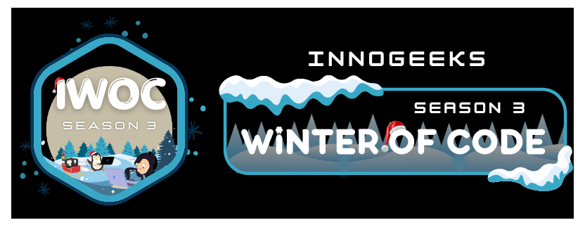

# 🌌 Planetoid  

Welcome to **Planetoid**, a fun and interactive website featuring a variety of mini-games set against the backdrop of outer space! From timeless classics like Tic-Tac-Toe to exciting challenges like Flappy Space Shuttle, Planetoid is your ultimate space-themed entertainment hub.  

---

  
  
  
  
  
  
  
  
  
  
  
  
  

### Featured In

<table>
<te>
      <td>Event Logo</td>
      <td>Event Name</td>
</tr>
  <tr>
        <td></td>
        <td><a href="https://innogeeks.in/">Innogeeks Winter of Code Season-3 (IWOC) </a>2025</td>
    </tr>
<tr>
        <td></td>
        <td><a href="https://www.socialwinterofcode.com/">Social Winter of Code Season-5 (SWOC) </a>2024-2025</td>
    </tr>
</table>

## 🚀 Features  

- **Mini-Games**  
  - 🎮 Tic-Tac-Toe: A classic strategy game with a stellar twist.  
  - 🚀 Flappy Space Shuttle: Navigate your shuttle through an asteroid field!  

- **Space Theme**  
  Immerse yourself in a cosmic experience with stunning visuals inspired by the wonders of the universe.  

- **Easy to Use**  
  A user-friendly and easy to access interface.
  
---

## 🛠️ Technologies  

Planetoid is built with the following technologies:  
- **Frontend**:    
- **Design**:    animations for a sleek, space-themed look  
- **Games**:   for game logic and interactivity  

---

## 📸 Screenshots  

---

### Contributions

Want to make contributions to this project? ✨

| **Read _[contribution guidelines!](documentation/contributing.md)_** |
|-|

---

## Visit Planetoid

| [`Visit Planetoid`](https://planetoid-games.netlify.app/) |
|-|

## Contributors
 A huge shoutout to all our wonderful contributors. 

